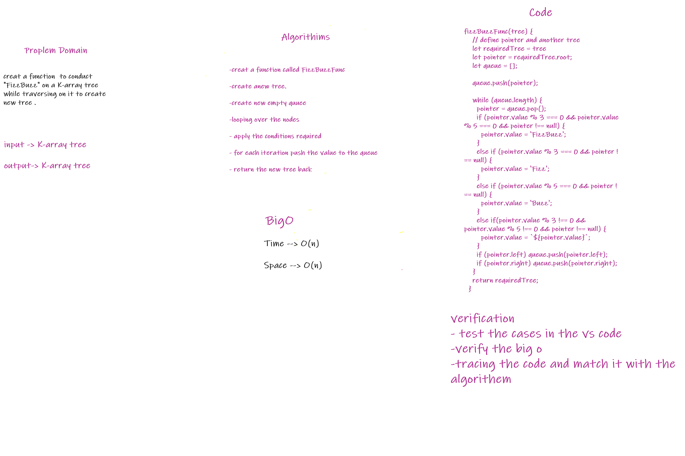

# Trees
A tree whose elements have at most 2 children is called a binary tree. Since each element in a binary tree can have only 2 children, we typically name them the left and right child

## Challenge
Conduct “FizzBuzz” on a k-ary tree while traversing through it to create a new tree.

## Approach & Efficiency
Used recursion to traverse through the tree with time complexity of n, Used Iterative approach to add to binary search tree with O(n), Used Iterative to check if element exists with O(n).

## API
* Class Node
* Class BinaryTree
  * Method inOrder (Takes the root) : Recursion O(n) traverses using the InOrder method.
  * Method preOrder (Takes the root) : Recursion O(n) traverses using the PreOrder method.
  * Method postOrder (Takes the root) : Recursion O(n) traverses using the PostOrder method.
* Class BinarySearchTree
  * Method add(data) : Iterativly adds an element to the right position O(n).
  * Method contains(key) : Iterativly searches an element exists to the right position O(n).

## WhiteBoard

