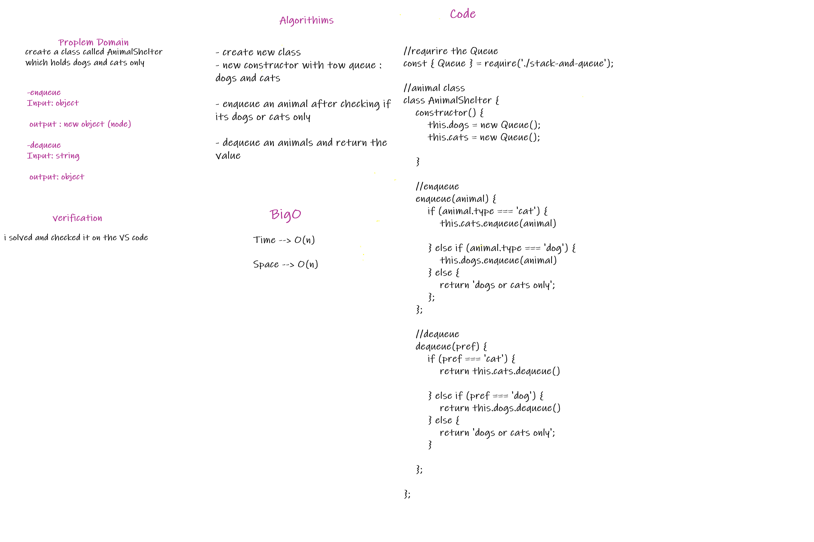

## Challenge
Node Create a Node class that has properties for the value stored in the Node, and a pointer to the next Node.

Linked List Create a Linked List class Within your Linked List class, include a head property. Upon instantiation, an empty Linked List should be created.

## API
* insert Arguments: value Returns: nothing Adds a new node with that value to the head of the list with an O(1) Time performance.

* includes Arguments: value Returns: Boolean Indicates whether that value exists as a Node’s value somewhere within the list.

* to string Arguments: none Returns: a string representing all the values in the Linked List

* append arguments: new value adds a new node with the given value to the end of the list

* insert before arguments: value, new value adds a new node with the given new value immediately before the first node that has the value specified

## Stacks and Queues
create stack and Queue classes

## Challenge
how to apply the approach of stack and Queue

## Approach & Efficiency
Big O

Time : O(n)

space : O(n)

## API
* push: takes any value as an argument and adds a new node with that value to the top of the stack class.

* pop :takes off the top value of the stack class,

* dequeue: removes the node from the top of the class, and returns the node’s value.

* enqueue: takes any value as an argument and adds a new node with that value to the back of the stack class.

* peek: returns the value of the node located in the front of Queue/top of the Stack without Changing

* isEmpty: returns a boolean indicating whether or not the class is empty

## Whiteboard Process

